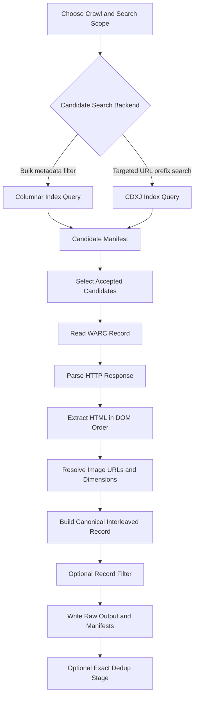

# CC Pipeline

`CC_pipeline` is the original prototype for building interleaved text-image training data from Common Crawl. It is HTML-first, local-first, and optimized for iterating on search, extraction, and record construction before moving to large-scale infrastructure.

## What this project does

- defines the canonical interleaved record format
- supports two candidate-search paths:
  - `Columnar Index` for bulk-style metadata filtering
  - `CDXJ Index` for fast targeted URL-prefix search
- reads WARC response records from local files and the earlier HTTPS path
- reconstructs text-image order from HTML DOM structure
- writes candidate, document, and raw-record JSONL manifests
- includes a first-pass filter layer and a separate exact dedup stage for formatted records

This project is the fallback path when we want to assume data is already fetchable and focus on candidate discovery, extraction quality, filtering, deduplication, and export.

## Current status

Implemented:

- canonical schema for aligned `texts` / `image` / `width` / `height` / `url`
- Common Crawl candidate objects and a prototype Columnar query path
- targeted CDXJ query path for faster URL-pattern search
- WARC parsing for response records
- DOM-order HTML extraction with lazy-image handling
- local JSONL output and append-only manifests
- basic record filtering
- separate exact dedup stage over formatted JSONL
- exact text cluster metadata
- exact canonical URL hash and source-capture-count metadata
- exact local image-byte hashes
- tests for schema, extraction, WARC parsing, Columnar querying, CDXJ querying, and bulk runner flow

Not implemented yet:

- production-grade PDF extraction
- image-byte fetching and validation
- robust boilerplate removal and main-content isolation
- scalable URL, image, and multimodal dedup
- production sharding/export

## Repository layout

- `src/cc_pipeline/`: core pipeline code
- `tests/`: unit and integration-style tests
- `out/`: example generated manifests and raw records from local experiments
- `docs/`: investigation notes and design documents

Key design note:

- `docs/dedup_investigation_and_design.md`: dedup investigation, tradeoffs, and proposed architecture

## Pipeline flow

The prototype can run through either the `Columnar` or `CDXJ` candidate path, then reuse the same downstream extraction stages.



Step by step:

1. Search Common Crawl metadata with either `Columnar` or `CDXJ`.
2. Convert hits into internal `CCIndexEntry` candidates with WARC pointers.
3. Score and keep accepted candidates.
4. Fetch and parse the corresponding WARC response record.
5. Extract text and image slots from HTML in document order.
6. Build the aligned output schema with `texts`, `image`, `width`, `height`, and `url`.
7. Optionally run the current prototype record filter.
8. Write raw records plus candidate/document manifests.
9. Optionally run the separate exact dedup stage over formatted JSONL.
10. The exact dedup stage annotates unique records with exact text, canonical URL, and local image-hash signals.

## Exact Dedup Outputs

The post-format exact dedup stage currently computes:

- `exact_text_hash`
- `exact_text_cluster_id`
- `exact_text_cluster_size`
- `exact_text_is_representative`
- `canonical_url`
- `canonical_url_hash`
- `source_capture_count`
- `image_exact_hashes`
- `image_exact_hash_count`

Current scope:

- exact text dedup uses normalized joined text from `texts`
- exact URL metadata uses canonicalized `general_metadata.canonical_url`
- exact image hashes are computed only when `image` points to a local file or `file://` path

Current outputs:

- unique-record JSONL with dedup metadata embedded in `general_metadata.dedup_signatures`
- duplicate-membership JSONL
- exact-cluster-stats JSONL

## Canonical output

Each document is emitted as one aligned multimodal record:

```json
{
  "texts": ["paragraph", null, "caption", null],
  "image": [null, "s3://bucket/images/abc.jpg", null, "s3://bucket/images/def.jpg"],
  "width": [null, 640, null, 1200],
  "height": [null, 480, null, 800],
  "url": [null, "https://example.com/a.jpg", null, "https://example.com/b.jpg"],
  "general_metadata": {
    "source_url": "https://example.com/article",
    "crawl_id": "CC-MAIN-2025-43"
  },
  "data_name": "commoncrawl_interleaved",
  "meta": {
    "slot_count": 4
  }
}
```

Rules:

- all slot arrays have the same length
- text slots populate only `texts`
- image slots populate only `image`, `width`, `height`, and `url`
- `general_metadata` carries source URL, crawl ID, WARC provenance, title, and language when available

## Typical local workflows

Process a local HTML file:

```bash
PYTHONPATH=src python3 -m cc_pipeline.cli local-html \
  --input-html sample.html \
  --page-url https://example.com/article \
  --output-jsonl out/documents.jsonl
```

Query a small Common Crawl slice through the prototype Columnar path:

```bash
PYTHONPATH=src python3 -m cc_pipeline.cli query-columnar \
  --crawl CC-MAIN-2025-51 \
  --domain commoncrawl.org \
  --limit 3
```

Run a targeted CDXJ lookup, which is usually much faster for exact URL-prefix searches:

```bash
PYTHONPATH=src python3 -m cc_pipeline.cli query-cdxj \
  --crawl CC-MAIN-2026-08 \
  --host en.wikipedia.org \
  --path-prefix /wiki/Cat \
  --limit 3
```

Run targeted end-to-end extraction through CDXJ:

```bash
PYTHONPATH=src python3 -m cc_pipeline.cli run-cdxj-extraction \
  --crawl CC-MAIN-2026-08 \
  --host en.wikipedia.org \
  --path-prefix /wiki/Cat \
  --candidate-limit 3 \
  --record-limit 3 \
  --candidate-manifest out/cdxj-candidates.jsonl \
  --document-manifest out/cdxj-documents.jsonl \
  --output-jsonl out/cdxj-raw.jsonl
```

Run exact-text dedup on already-formatted records:

```bash
PYTHONPATH=src python3 -m cc_pipeline.cli exact-dedup-jsonl \
  --input-jsonl out/cdxj-raw.jsonl \
  --unique-output-jsonl out/unique.jsonl \
  --duplicate-manifest out/exact-duplicates.jsonl \
  --cluster-stats-jsonl out/exact-clusters.jsonl
```

Example phase-2 exact dedup artifacts from a local test:

- input: `out/phase2_exact_dedup_input.jsonl`
- unique output: `out/phase2_exact_dedup_unique.jsonl`
- duplicate manifest: `out/phase2_exact_dedup_duplicates.jsonl`
- cluster stats: `out/phase2_exact_dedup_clusters.jsonl`

Run a small end-to-end extraction test through the Columnar path:

```bash
PYTHONPATH=src python3 -m cc_pipeline.cli run-columnar-extraction \
  --crawl CC-MAIN-2025-43 \
  --path-limit 1 \
  --rows-per-batch 3 \
  --candidate-limit 3 \
  --record-limit 3 \
  --candidate-manifest out/candidates.jsonl \
  --document-manifest out/documents.jsonl \
  --output-jsonl out/raw.jsonl
```

## Tests

```bash
python3 -m pytest
```
