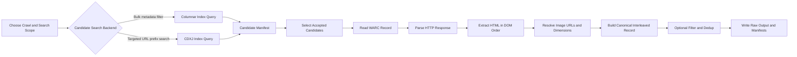

# CC Pipeline Prototype

This project is the original local-first Common Crawl pipeline prototype. It is the best place to work when data has already been fetched and the main goal is to improve candidate discovery, extraction quality, filtering, deduplication, and export logic.

## Scope

The prototype currently covers:

- canonical interleaved record schema
- two candidate-search paths:
  - `Columnar Index` for bulk-style metadata filtering
  - `CDXJ Index` for fast targeted URL-prefix search
- WARC response parsing
- HTML DOM-order text-image reconstruction
- candidate and manifest handling
- local JSONL output
- basic quality filtering
- prototype text deduplication

It is intentionally simpler than the AWS-oriented pipeline and remains the fallback path when infrastructure is unavailable.

## Current Status

Implemented:

- aligned `texts` / `image` / `width` / `height` / `url` schema
- Common Crawl candidate objects and a prototype Columnar query path
- targeted CDXJ query path for faster URL-pattern search
- local and earlier HTTPS-oriented WARC handling
- HTML extraction with common lazy-image attribute support
- append-only candidate, document, and raw-record manifests
- basic record-level filtering
- exact and near-text deduplication
- tests for schema, WARC parsing, extraction, Columnar querying, CDXJ querying, and pipeline flow

Still TODO:

- production-grade PDF extraction
- stronger boilerplate removal and content isolation
- per-slot image pruning instead of brittle whole-record rejection
- image fetching and validation for local or remote corpora
- scalable URL, image, and document-level deduplication
- shard/export formats such as Parquet or WebDataset

## Project Layout

- `src/cc_pipeline/`: core implementation
- `tests/`: test suite
- `docs/`: investigation notes and design material

## Pipeline Flow

The prototype supports either a `Columnar` or `CDXJ` search step, then reuses the same downstream extraction path.



Step by step:

1. Search Common Crawl metadata with either `Columnar` or `CDXJ`.
2. Convert hits into internal `CCIndexEntry` candidates with WARC pointers.
3. Score and keep accepted candidates.
4. Fetch and parse the corresponding WARC response record.
5. Extract text and image slots from HTML in document order.
6. Build the aligned output schema with `texts`, `image`, `width`, `height`, and `url`.
7. Optionally run the current prototype filter and text dedup stages.
8. Write raw records plus candidate/document manifests.

## Canonical Output

Each document is emitted as one aligned multimodal record:

```json
{
  "texts": ["paragraph", null, "caption", null],
  "image": [null, "s3://bucket/images/abc.jpg", null, "s3://bucket/images/def.jpg"],
  "width": [null, 640, null, 1200],
  "height": [null, 480, null, 800],
  "url": [null, "https://example.com/a.jpg", null, "https://example.com/b.jpg"],
  "general_metadata": {
    "source_url": "https://example.com/article",
    "crawl_id": "CC-MAIN-2025-43"
  },
  "data_name": "commoncrawl_interleaved",
  "meta": {
    "slot_count": 4
  }
}
```

## Installation

```bash
python3 -m pip install -e .[dev]
```

## Example Workflows

Process a local HTML file:

```bash
PYTHONPATH=src python3 -m cc_pipeline.cli local-html \
  --input-html sample.html \
  --page-url https://example.com/article \
  --output-jsonl out/documents.jsonl
```

Run a targeted CDXJ lookup:

```bash
PYTHONPATH=src python3 -m cc_pipeline.cli query-cdxj \
  --crawl CC-MAIN-2026-08 \
  --host en.wikipedia.org \
  --path-prefix /wiki/Cat \
  --limit 3
```

Run targeted end-to-end extraction through CDXJ:

```bash
PYTHONPATH=src python3 -m cc_pipeline.cli run-cdxj-extraction \
  --crawl CC-MAIN-2026-08 \
  --host en.wikipedia.org \
  --path-prefix /wiki/Cat \
  --candidate-limit 3 \
  --record-limit 3 \
  --candidate-manifest out/cdxj-candidates.jsonl \
  --document-manifest out/cdxj-documents.jsonl \
  --output-jsonl out/cdxj-raw.jsonl
```

Run a small prototype Common Crawl extraction through the Columnar path:

```bash
PYTHONPATH=src python3 -m cc_pipeline.cli run-columnar-extraction \
  --crawl CC-MAIN-2025-43 \
  --path-limit 1 \
  --rows-per-batch 3 \
  --candidate-limit 3 \
  --record-limit 3 \
  --candidate-manifest out/candidates.jsonl \
  --document-manifest out/documents.jsonl \
  --output-jsonl out/raw.jsonl
```

## Tests

```bash
python3 -m pytest
```

## Notes

See [`docs/cc_investigation_and_dedup.md`](docs/cc_investigation_and_dedup.md) for the investigation summary and the original dedup roadmap.
